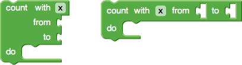

# 定义区块

区块定义描述了区块的外观、行为，包括文本、颜色、形状以及连接内容。

区块定义包含 `JSON` 对象和 `JavaScript` 函数两种方式，其中 `JSON` 格式可以跨平台使用，但无法定义转换器（`mutators`）或 校验（`validators`）等较高级的特性。 `JavaScript` 可在函数内调用 `Blockly` 接口方法实现区块定义，并定义高级特性，但不具备跨平台性。

推荐使用 `JSON` 定义区块，用 `JavaScript`）定义 `JSON` 不支持的部分。

```js
var mathChangeJson = {
  "message0": "change %1 by %2",
  "args0": [
    {"type": "field_variable", "name": "VAR", "variable": "item", "variableTypes": [""]},
    {"type": "input_value", "name": "DELTA", "check": "Number"}
  ],
  "previousStatement": null,
  "nextStatement": null,
  "colour": 230
};

Blockly.Blocks['math_change'] = {
  init: function() {
    this.jsonInit(mathChangeJson);
    // Assign 'this' to a variable for use in the tooltip closure below.
    var thisBlock = this;
    this.setTooltip(function() {
      return 'Add a number to variable "%1".'.replace('%1',
          thisBlock.getFieldValue('VAR'));
    });
  }
};
```

## 区块颜色（Colour）

// `JSON` 中的 `colour` 属性定义了区块的基本色（`primary colour`）

```json
{
  // ...,
  "colour": 160,
}
```

## 语句连接（Statement）

区块可通过 `nextStatement` 和 `previousStatement` 连接器连接成串。一个区块通常都会包含一个前连接点和一个后连接点。

```json
{
  "nextStatement": null,
  "previousStatement": null,
}
```

### 后连接

一个区块只有后连接点，没有前连接，通常表现为事件。

### 前连接

包含前连接的区块不能有输出连接，反之亦然。

## 区块输出（Output）

区块可以包含一个输出，该输出连接值输入，这种区块通常称为值块（`value blocks`）


```json
{
  "output": "Number"
}
```

## 区块输入（Input）

输入由一串文本（`labels`）和字段值（`fields`）组成，区块可以有一个或多个输入。

输入有三种类型：

- 值输入： 连接值块的输出连接点
- 语句输入： 连接语句区块的前连接点
- 虚拟输入： 区块内部输入占位，使用外部值块


### `JSON` 中的输入和字段

`JSON` 通过插值字符串定义区块，其中插值符号 `%1, %2,...` 表示一个字段或输入，并与 `JSON` `argsN` 数组下的定义匹配。

```json
{
  "message0": "set %1 to %2",
  "args0": [
    {
      "type": "field_variable",
      "name": "VAR",
      "variable": "item",
      "variableTypes": [""],
      "alt":
        {
          "type": "field_input",
          "name": "TEMPOTEXT",
          "text": "a"
        }
    },
    {
      "type": "input_value",
      "name": "VALUE"
    }
  ]
}
```

#### `Args` 字段

`JSON` 对象中的 `message` 和 `args` 是一一对应的，如`message0` 与 `args0` 对应，插值符 `%1, %2,...` 与 `args` 的数组项对应。

字段类型：

[内置字段](#built-in-%e5%86%85%e7%bd%ae%e5%ad%97%e6%ae%b5)

输入类型：

- `input_value`
- `input_statement`
- `input_dummy`

`args` 项均包含 `alt` 字段。在 `type` 属性不被识别时，用 `alt` 进行替换

### 输入内联或外接

通过 `inputsInline` 设置输入为内联或外接形式。



```json
{
  // ...,
  "inputsInline": true
}
```

## `Fields` 字段

字段用于定义区块的 UI 元素，如字符串文本、图片及字符串和数字数据输入。

### Built-in 内置字段

- `field_input`
- `field_dropdown`
- `field_checkbox`
- `field_colour`
- `field_number`
- `field_angle`
- `field_variable`
- `field_date`
- `field_label`
- `field_image`

[Built-in Field](https://developers.google.com/blockly/guides/create-custom-blocks/fields/built-in-fields/overview)

### 自定义字段

## 修改监听和校验

## 修改z转换器（mutators）
