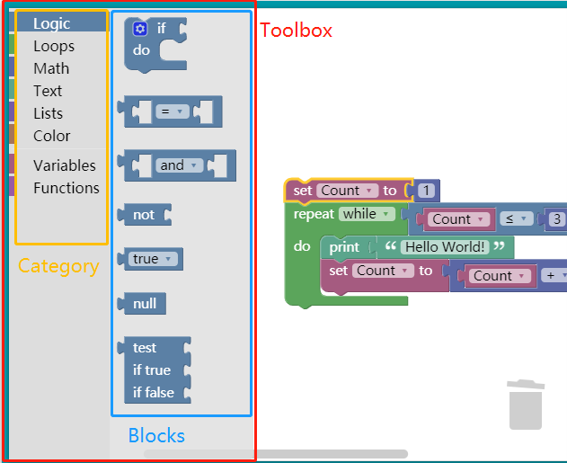

索引：
- [`Toolbox`](#toolbox)
  - [分类目录](#%e5%88%86%e7%b1%bb%e7%9b%ae%e5%bd%95)
    - [属性](#%e5%b1%9e%e6%80%a7)
    - [动态目录](#%e5%8a%a8%e6%80%81%e7%9b%ae%e5%bd%95)
    - [嵌套目录](#%e5%b5%8c%e5%a5%97%e7%9b%ae%e5%bd%95)
  - [积木（区块）组](#%e7%a7%af%e6%9c%a8%e5%8c%ba%e5%9d%97%e7%bb%84)
  - [`Shadow blocks`](#shadow-blocks)
  - [变量](#%e5%8f%98%e9%87%8f)
  - [分隔符](#%e5%88%86%e9%9a%94%e7%ac%a6)
  - [按钮和文本](#%e6%8c%89%e9%92%ae%e5%92%8c%e6%96%87%e6%9c%ac)

----

# `Toolbox`



`Toolbox` 由 `XML` 定义，包括节点树结构和字符串两种形式：

节点树：

```xml
<xml id="toolbox" style="display: none">
  <block type="controls_if"></block>
  <block type="controls_whileUntil"></block>
</xml>
```

字符串：

```js
var toolbox = '<xml>';
  toolbox += '  <block type="controls_if"></block>';
  toolbox += '  <block type="controls_whileUntil"></block>';
  toolbox += '</xml>';
```

## 分类目录

对 区块（`block`）进行分类，用 `<category>` 定义。

```xml
<xml id="toolbox" style="display: none">
  <category name="Control">
    <block type="controls_if"></block>
    <block type="controls_whileUntil"></block>
    <block type="controls_for">
  </category>
</xml>
```

### 属性

|名称|作用|备注|
|------|------|-----|
|colour|修改目录颜色|hue 颜色值（0-360）|
|custom|创建自定义目录/动态目录||
|expanded|是否展开嵌套目录|Boolean|

```xml
<category name="Logic" colour="210">...</category>
```

### 动态目录

使用 `custom` 属性创建动态目录。系统预留了 变量（`Variable`） 和 函数（`function`）两个分类，可在其上面添加内容或另外创建自定义分类目录。

```xml
<category name="Variables" custom="VARIABLE"></category>
<category name="Functions" custom="PROCEDURE"></category>
```

**创建步骤**

- 创建自定义目录

  `<category name="Colours" custom="COLOUR_PALETTE"></category>`

- 定义回调函数，并返回区块（`blocks`）内容

```js
/**
 * Construct the blocks required by the flyout for the colours category.
 * @param {!Blockly.Workspace} workspace The workspace this flyout is for.
 * @return {!Array.<!Element>} Array of XML block elements.
 */
myApplication.coloursFlyoutCallback = function(workspace) {
  // Returns an array of hex colours, e.g. ['#4286f4', '#ef0447']
  var colourList = myApplication.getPalette();
  var xmlList = [];
  if (Blockly.Blocks['colour_picker']) {
    for (var i = 0; i < colourList.length; i++) {
      var blockText = '<block type="colour_picker">' +
          '<field name="COLOUR">' + colourList[i] + '</field>' +
          '</block>';
      var block = Blockly.Xml.textToDom(blockText);
      xmlList.push(block);
    }
  }
  return xmlList;
};
```

- 在工作区（`workspace`)中注册回调函数

```js
myWorkspace.registerToolboxCategoryCallback(
  'COLOUR_PALETTE', myApplication.coloursFlyoutCallback);
```

### 嵌套目录

支持子目录。

```xml
<xml id="toolbox" style="display: none">
  <category name="Core">
    <category name="Control">
      <block type="controls_if"></block>
      <block type="controls_whileUntil"></block>
    </category>
    <category name="Logic">
      <block type="logic_compare"></block>
      <block type="logic_operation"></block>
      <block type="logic_boolean"></block>
    </category>
  </category>
</xml>
```

## 积木（区块）组

`XML` 由 单个区块或多个区块组 构成。

## `Shadow blocks`

`Shadow blocks` 为占位区块，有以下作用：

- 为父区块提供默认值

- 可以直接修改值

- 可被其它区块替换

- 提示该区位的值类型

```xml
<shadow type="math_number">
  <field name="NUM">1</field>
</shadow>
```

## 变量

`toolbox` 通过 `<field>` 设置变量，一般由 `name` 属性及其`value`值组成。

```xml
<field name="NUM">1</field>
```

**属性**

|属性名|说明|备注
|------|-----|----|
|name|变量名称||
|id|唯一性标识||
|variabletype|变量类型|如果设置了id值，那么该变量的类型和值需与该区块（block）的变量匹配（？）|

## 分隔符

用分隔符 `<sep></sep>`  分隔分类目录或区块间的间距，默认 `24px`， 可通过 `gap` 属性进行修改。

```xml
<sep gap="32"></sep>
```

## 按钮和文本

可以通过标签 `<button>` 和 `<label>` 在 `toolbox` 中添加按钮和文本。

**定义文本**

```xml
<label text="A label" web-class="myLabelStyle"></label>
```

定义文本时，可用 `web-class` 属性修改文本样式。

```html
<style>
.myLabelStyle>.blocklyFlyoutLabelText {
  font-style: italic;
  fill: green;
}
</style>
```

**定义按钮**

```xml
<button text="A button" callbackKey="myFirstButtonPressed"></button>
```

定义按钮时，需定义回调函数，相应点击事件：

```js
yourWorkspace.registerButtonCallback('myFirstButtonPressed', yourFunction).
```
